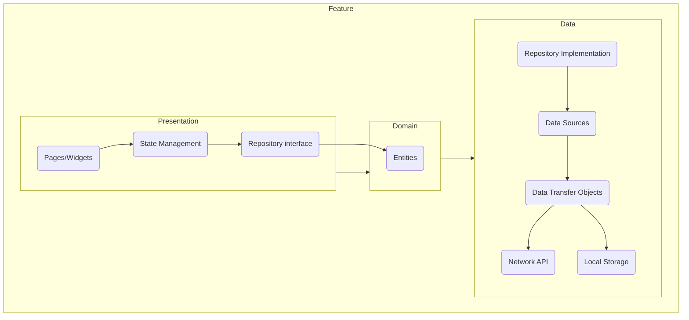

# System Patterns

## System Architecture

This document outlines the architectural patterns, key technical decisions, and component relationships for the Health Wallet application.

### High-Level Architecture

The application follows a clean architecture pattern, separating concerns into distinct layers. This promotes a modular, scalable, and maintainable codebase.

### Directory Structure

my_app/
├── lib/
│   ├── app/                              # Core application setup
│   │   ├── app.dart                      # Barrel file (exports main app)
│   │   ├── view/                         # UI-related setup
│   │   │   └── app_view.dart             # Main App widget (MaterialApp)
│   ├── core/                             # Core Functionality (Shared Code)
│   │   ├── config/                       # Configuration files
│   │   │   ├── app_bloc_observer.dart    # Global BLoC Observer (if needed for BLoC)
│   │   │   ├── app_constants.dart        # Global Constants (e.g., API URLs, App Strings)
│   │   │   ├── app_dependencies.dart     # Dependency Injection Setup (GetIt, Provider)
│   │   │   ├── app_env.dart              # Environment Variables (dev, staging, production)
│   │   │   └── app_localization.dart     # Localization Configuration
│   │   ├── l10n/                         # Localization Setup (Moved to core)
│   │   │   ├── arb/                      # Language Resource Files (.arb)
│   │   │   │   ├── app_en.arb            # English Translation
│   │   │   │   ├── app_es.arb            # Spanish Translation
│   │   │   │   └── app_fr.arb            # French Translation
│   │   │   ├── app_localizations.dart    # Generated Localization Class
│   │   │   └── l10n.dart                 # Localization Configuration
│   │   ├── models/                       # Shared Data Models used across features
│   │   ├── navigation/                   # Navigation Service (for auto_route)
│   │   ├── services/                     # Common Services (local storage, network handling)
│   │   │   ├── local_database/           # Local Database Service (Hive, SQLite)
│   │   │   ├── network/                  # Network Service (Dio, HTTP)
│   │   │   └── shared_preference/        # Shared Preferences for Key-Value Storage
│   │   ├── theme/                        # Theme Management
│   │   │   ├── app_color.dart            # App-wide Color Palette
│   │   │   ├── app_text_style.dart       # Global Text Styles
│   │   │   └── theme.dart                # Main Theme Configuration
│   │   ├── utils/                        # Common Utility Functions (formatters, helpers)
│   │   └── widgets/                      # Shared Reusable UI Components
│   ├── features/                         # Feature Modules (Clean Architecture)
│   │   ├── auth/                         # Authentication Module
│   │   │   ├── auth.dart                 # Main authentication entry point
│   │   │   ├── data/                     # Data Layer
│   │   │   │   ├── data_source/          # Handles data retrieval
│   │   │   │   │   ├── local/            # Local storage (SharedPrefs, Hive)
│   │   │   │   │   └── network/          # API calls, Firebase, GraphQL
│   │   │   │   ├── dto/                  # Data Transfer Objects (API Models)
│   │   │   │   └── repository/           # Repository Implementation
│   │   │   ├── domain/                   # Business Logic Layer
│   │   │   │   ├── entity/               # Core business models
│   │   │   │   └── repository/           # Abstract Repository Interface
│   │   │   └── presentation/             # UI Layer
│   │   │       ├── bloc/                 # BLoC (State Management)
│   │   │       ├── pages/                # Screens and Pages
│   │   │       └── widgets/              # Reusable UI Components
│   │   ├── dashboard/                    # Dashboard Module
│   │   │   └── dashboard.dart            # Dashboard Screen and Logic
│   │   ├── home/                         # Home Module
│   │   │   ├── data/                     # Data Layer
│   │   │   │   ├── data_source/          # Handles data retrieval
│   │   │   │   │   ├── local/            # Local storage (SharedPrefs, Hive)
│   │   │   │   │   └── network/          # API calls, Firebase, GraphQL
│   │   │   │   ├── dto/                  # Data Transfer Objects (API Models)
│   │   │   │   └── repository/           # Repository Implementation
│   │   │   ├── domain/                   # Business Logic Layer
│   │   │   │   └── repository/           # Abstract Repository Interface
│   │   │   ├── presentation/             # UI Layer
│   │   │   │   ├── bloc/                 # BLoC (State Management)
│   │   │   │   ├── pages/                # Screens and Pages
│   │   │   │   ├── widgets/              # Reusable UI Components
│   │   │   │   └── home.dart             # Home entry point
│   │   ├── records/                      # Records Module (aggregates medical data)
│   │   │   ├── records.dart              # Main records entry point
│   │   │   ├── data/                     # Data Layer
│   │   │   │   ├── dto/                  # Data Transfer Objects (API Models)
│   │   │   │   │   ├── allergy/
│   │   │   │   │   │   └── allergy_dto.dart
│   │   │   │   │   └── medication/
│   │   │   │   │       └── medication_dto.dart
│   │   │   ├── domain/                   # Domain Layer
│   │   │   │   ├── entity/
│   │   │   │   │   ├── allergy/
│   │   │   │   │   │   └── allergy.dart
│   │   │   │   │   └── medication/
│   │   │   │   │       └── medication.dart
│   │   │   │   └── repository/
│   │   │   └── presentation/             # UI Layer
│   │   └── user/                         # User Profile Module
│   │       ├── data/                     # Data Layer
│   │       │   ├── data_source/          # Handles data retrieval
│   │       │   │   ├── local/            # Local storage (SharedPrefs, Hive)
│   │       │   │   └── network/          # API calls, Firebase, GraphQL
│   │       │   ├── dto/                  # Data Transfer Objects (API Models)
│   │       │   └── repository/           # Repository Implementation
│   │       ├── domain/                   # Business Logic Layer
│   │       │   └── repository/           # Abstract Repository Interface
│   │       ├── presentation/             # UI Layer
│   │       │   ├── bloc/                 # BLoC (State Management)
│   │       │   ├── pages/                # Screens and Pages
│   │       │   ├── widgets/              # Reusable UI Components
│   │       │   └── user.dart             # Main user profile entry point
│   ├── gen/                              # Auto-Generated Code (flutter_gen, JSON serialization)
│   │   └── assets.gen.dart               # Auto-generated asset references
│   └── main.dart                         # Main Entry Point for Flutter App
└── pubspec.yaml                          # Project Configuration (Dependencies, Assets, etc.)

### Key Technical Decisions

-   **State Management:** The project uses the `flutter_bloc` package for state management to ensure a predictable state flow and separation of concerns.
-   **Dependency Injection:** `get_it` and `injectable` are used for managing dependencies, making the codebase more modular and testable.
-   **Navigation:** `auto_route` is used for declarative routing, simplifying navigation and deep linking.
-   **Networking:** The `dio` package is used for making HTTP requests, with interceptors for handling authentication and logging.
-   **Local Storage:** `shared_preferences` is used for simple key-value storage, while `drift` is used for complex data.

### Component Relationships

-   **Features:** The application is organized by features (e.g., authentication, user, dashboard). Each feature is self-contained and includes its own presentation, domain, and data layers.
-   **Core:** A `core` directory contains shared components, services, and utilities that are used across multiple features.
